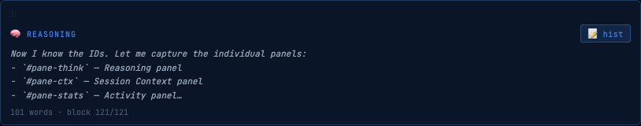
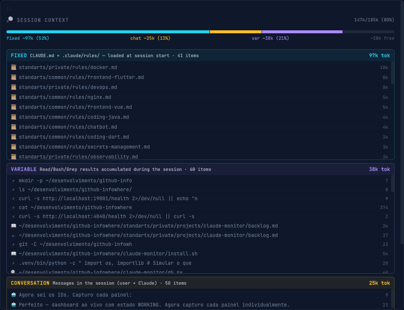
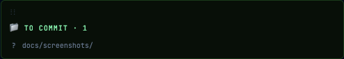
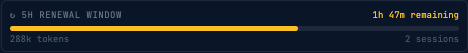

<div align="center">
  

  # Claude Insights

  **Real-time dashboard for Claude Code sessions**

  Monitor what Claude is doing across all your projects — live status, token usage,
  session context, reasoning history, and git changes.

  
  
  
  [](https://pypi.org/project/claude-insights/)

  *by [Leandro Siciliano](https://github.com/ltsiciliano) · InfoWhere*
</div>

---


*Live session — WORKING state, all panels visible*

Claude Insights is a lightweight web dashboard that connects to Claude Code via hooks.
It shows live status, token usage, session context, reasoning blocks, and uncommitted
git changes — across all your projects simultaneously. Everything runs locally.
No data leaves your machine.

---

## Installation

**Homebrew** (macOS)

```bash
brew tap infowhere-ai/claude-insights
brew install claude-insights
```

**pipx** (macOS / Linux)

```bash
pipx install claude-insights
```

**curl** (one-liner, any platform)

```bash
curl -fsSL https://raw.githubusercontent.com/infowhere-ai/claude-insights/main/install.sh | bash
```

After installing, see [Quick Start](#quick-start) below to activate the hooks.

---

## Quick Start

1. **Activate hooks** — sets up the hook script at `~/.claude/hooks/monitor-hook.sh` and registers it for 5 Claude Code events in `~/.claude/settings.json`:

   ```bash
   claude-insights install
   ```

   > Existing hooks are never removed or modified.

2. **Restart Claude Code** — required for the hooks to take effect in open sessions.

3. **Start the dashboard**:

   ```bash
   claude-insights start
   ```

   Opens at **http://localhost:4000**

---

## How It Works

> Claude Code fires hooks at key moments — before and after each tool call, on
> notifications, on stop. Each hook writes a small JSON file to `.claude/status.json`
> inside the current project. Claude Insights watches those files and streams
> updates to the browser via Server-Sent Events.

```
Claude Code  →  hook fires  →  .claude/status.json  →  Claude Insights (SSE)  →  browser
```

---

## Features

| Area | What you see |
|------|-------------|
| **Live status** | Current state: working, waiting, compacting, idle — with the exact tool name |
| **Reasoning** | Claude's internal thinking live as it arrives; full history browsable |
| **Session context** | Context window breakdown: fixed rules, conversation, tool results — with token costs |
| **Token usage** | Input, output, cache reads — per session and 5-hour renewal window |
| **Commands** | Every tool call with path, duration, and success/failure |
| **To commit** | Uncommitted git changes; click any file for a side-by-side diff viewer |
| **Multi-project** | Monitors all projects under a root folder — auto-discovered |
| **Session history** | Browse past sessions; replay events and reasoning blocks |

<div align="center">
  
  <p><em>Live reasoning stream — Claude's internal thinking as it arrives</em></p>
</div>

<div align="center">
  
  <p><em>Context window breakdown by category with token costs</em></p>
</div>

<div align="center">
  
  <p><em>Uncommitted files — click any file to open the side-by-side diff viewer</em></p>
</div>

<div align="center">
  
  <p><em>5-hour token renewal window tracker</em></p>
</div>

---

## Requirements

- Python 3.10+
- [Claude Code CLI](https://claude.ai/code) (`claude`) in PATH
- macOS or Linux
- Git

---

## Configuration

| Variable | Default | Description |
|----------|---------|-------------|
| `PORT` | `4000` | HTTP port for the dashboard |
| `PROJECTS_ROOT` | Set during `claude-insights install` | Root folder containing your project directories |

```bash
PORT=8080 PROJECTS_ROOT=~/code claude-insights start
```

Any directory under `PROJECTS_ROOT` that contains a `.claude/` folder is monitored automatically.

---

## Uninstall

```bash
claude-insights uninstall
```

Removes the hook script and deregisters hooks from `~/.claude/settings.json`.
Your other Claude Code hooks and settings are preserved.

---

## Development

For running from source:

```bash
git clone https://github.com/infowhere-ai/claude-insights.git
cd claude-insights
./install.sh        # sets up hooks
./run.sh start      # starts the server (source install — default port: 19001)
```

Stack: Python 3.10+ · FastAPI · SSE · Vanilla JS (no build step)

---

## License

MIT — © 2026 Leandro Siciliano
