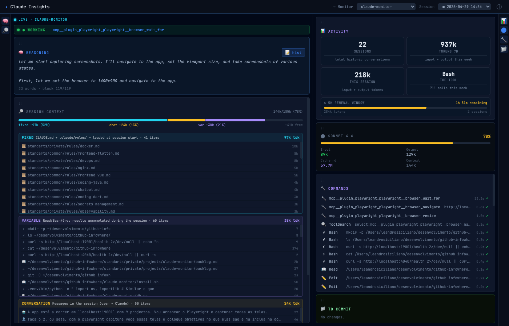

<div align="center">
  

  # Claude Insights

  **Real-time dashboard for Claude Code sessions**

  Monitor what Claude is doing across all your projects — live status, token usage, session context, git changes, and reasoning history.

  
  
  

  *by [Leandro Siciliano](https://github.com/ltsiciliano)*
</div>

---



## What it does

Claude Insights is a lightweight web dashboard that connects to Claude Code via hooks. It shows you exactly what Claude is doing in real time — which tool it is running, what files it touched, how many tokens the session has consumed, and what is in the context window.

Everything runs **locally**. No data leaves your machine.

---

## Features

| Area | What you see |
|------|-------------|
| **Live status** | Current state — working, waiting for input, compacting, idle |
| **Reasoning** | Claude's internal thinking, live as it streams |
| **Session context** | Full breakdown of the context window: fixed rules, conversation, tool results |
| **Token usage** | Input, output, cache — per session and weekly totals |
| **Commands** | Every tool call with arguments, result preview, and token cost |
| **To commit** | Uncommitted git changes with inline diff viewer |
| **Multi-project** | Monitors all projects under a root folder simultaneously |
| **Session history** | Browse past sessions and replay their events |

---

## How it works

```
Claude Code  →  hook fires  →  .claude/status.json  →  Claude Insights (SSE)  →  browser
```

Claude Code hooks write a small JSON file to `.claude/status.json` inside each project directory every time Claude calls a tool. Claude Insights watches those files and streams updates to the browser via [Server-Sent Events](https://developer.mozilla.org/en-US/docs/Web/API/Server-sent_events). The JSONL session files written by Claude Code are also read directly to extract reasoning, tool calls, and conversation history.

---

## Requirements

- **Python 3.10+**
- **Claude Code CLI** (`claude`) installed and in PATH
- **macOS or Linux**
- **Git** (for the diff viewer)

---

## Installation

```bash
git clone https://github.com/infowhere-ai/claude-insights.git
cd claude-monitor
./install.sh
```

The installer will:

1. Check that `python3` and `claude` are available
2. Create a Python virtual environment inside the project folder (`.venv/`)
3. Install Python dependencies (FastAPI, uvicorn, httpx)
4. Copy the hook script to `~/.claude/hooks/monitor-hook.sh`
5. Register the hook in `~/.claude/settings.json`

### What the installer touches on your machine

| Location | What | Reversible |
|----------|------|-----------|
| `~/.claude/settings.json` | Adds hook entries for 5 Claude Code events | Yes — remove the entries manually |
| `~/.claude/hooks/monitor-hook.sh` | The hook script that writes status files | Yes — delete the file |
| `<project>/.claude/status.json` | Written at runtime by the hook (one per project) | Yes — gitignored by default |
| `.venv/` inside claude-monitor | Python virtual environment | Yes — delete the folder |

No data is sent to any server. The hook script only writes a small JSON file to the current project directory.

> **Existing hooks are preserved.** The installer reads your current `settings.json` and adds only what is missing — it never removes or overwrites existing hooks.

---

## Start / stop

```bash
./run.sh start          # start and open in browser
./run.sh stop           # stop the server
./run.sh restart        # restart
./run.sh status         # check if running
```

The server starts on **http://localhost:19001** by default.

---

## Configuration

| Variable | Default | Description |
|----------|---------|-------------|
| `PORT` | `19001` | HTTP port |
| `PROJECTS_ROOT` | parent of claude-monitor | Root folder containing your project directories |

```bash
PORT=8080 PROJECTS_ROOT=~/code ./run.sh start
```

Claude Insights auto-discovers any project that has a `.claude/` directory under `PROJECTS_ROOT`.

---

## Uninstall

```bash
# 1. Stop the server
./run.sh stop

# 2. Remove the hook script
rm ~/.claude/hooks/monitor-hook.sh

# 3. Remove hook entries from ~/.claude/settings.json
#    Open the file and delete the entries that reference monitor-hook.sh

# 4. Delete the project folder
cd .. && rm -rf claude-monitor
```

---

## Project structure

```
claude-monitor/
├── app.py              # FastAPI backend — SSE, git diff, context inspector
├── static/
│   ├── insights.html   # Dashboard (vanilla JS, no build step)
│   ├── logo.png        # Brand logo
│   ├── manifest.json
│   └── sw.js
├── install.sh          # Installer — sets up hooks and dependencies
├── run.sh              # Start / stop helper
└── requirements.txt
```

---

## License

MIT — © 2026 Leandro Siciliano
